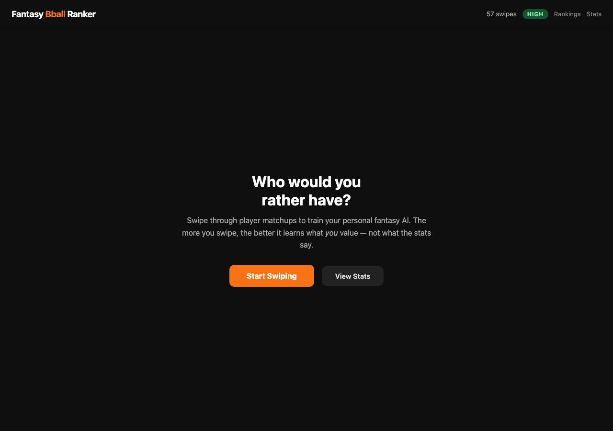
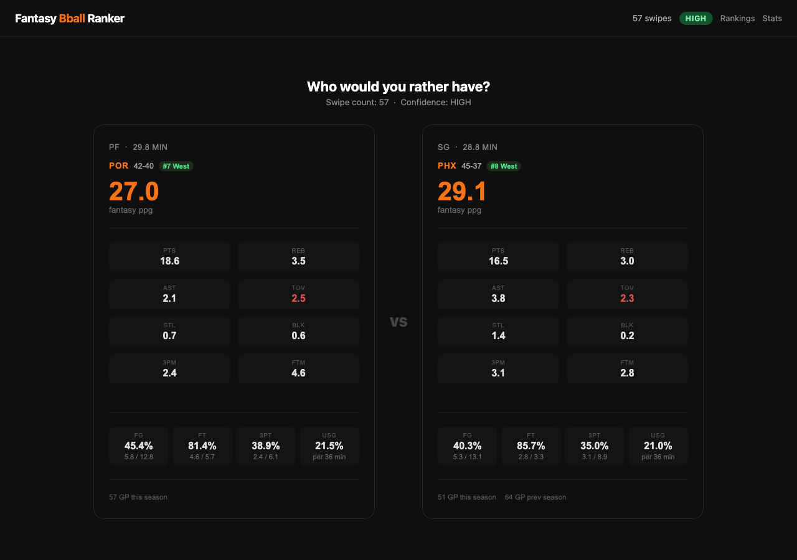
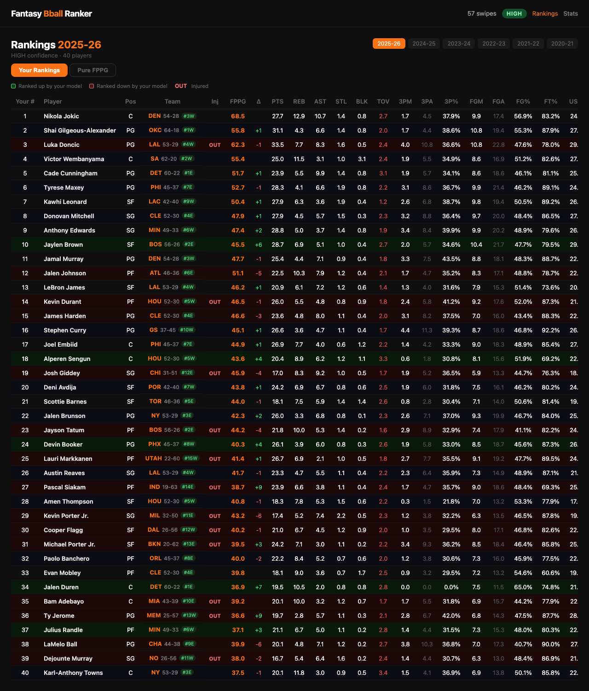
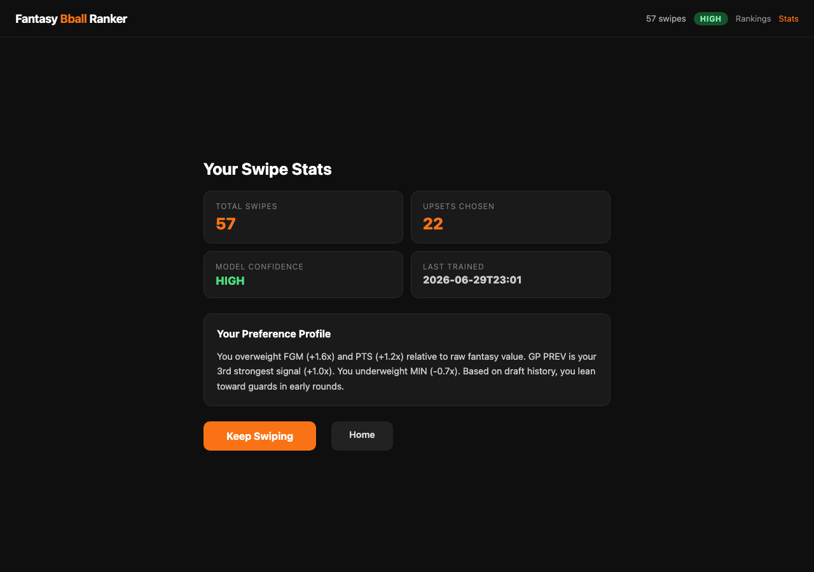

# Fantasy Basketball AI Ranker

**A pure ML ranker that ranks NBA players the way I would, trained on my own draft history and player preferences.**

1. **ETL Pipeline** pulls ESPN fantasy stats for 6 seasons, computes fantasy points per game under my league's scoring, and stores everything in SQLite.
2. **Stat Model** (`models/stat_model.py`) fits a `LinearRegression` trained on 2019–24 seasons to predict current-season fantasy PPG. Also generates four diagnostic plots (tier chart, correlation heatmap, positional boxplot, predicted vs actual).
3. **Intuition Model** (`models/intuition_model.py`) trains a `LogisticRegression` on pairwise comparisons — swipes from the Flask UI and implicit preferences inferred from draft order. It learns which stats I actually value, not what the model says I should.
4. **Blended Ranker** (`models/ranker.py`) takes the top 60 players by fantasy PPG, runs a round-robin tournament using the intuition model, then blends 65% stat rank + 35% intuition score into a final top 40.

---

## Screenshots

**Landing page**


**Swipe UI** — pick which player you'd rather have; stats shown side-by-side


**Rankings** — personalized top-40 blending stat model + your intuition


**Stats** — swipe history, model confidence, and your learned preference profile


---

## Tech Stack

| Layer | Technology |
|---|---|
| Data ingestion | Python 3.11+, ESPN Fantasy API |
| Storage | SQLite |
| Statistical model | scikit-learn (`LinearRegression`) |
| Intuition model | scikit-learn (`LogisticRegression`), joblib |
| Swipe UI | Flask |
| Output | openpyxl (Excel), matplotlib |
| Analysis notebook | Jupyter |
| Tests | pytest |

---

## ESPN H2H Points Scoring

```
PTS = +1    (every point scored)
3PM = +1    (three-pointer made bonus)
FGM = +2    (field goal made)
FGA = -1    (field goal attempt)
FTM = +1    (free throw made)
FTA = -1    (free throw attempt)
REB = +1    (rebound)
AST = +2    (assist)
STL = +4    (steal)
BLK = +4    (block)
TOV = -2    (turnover)
```

**Derived per-shot values:**
- Three-pointer made = **5 pts** (3+1+2-1)
- Two-pointer made = **3 pts** (2+2-1)
- Free throw made = **1 pt** (1+1-1)

This scoring heavily rewards efficiency, elite perimeter defenders, and playmakers — pure volume scorers are penalized by FGA and TOV.

---

## The Intuition Model

The core differentiator. Most fantasy tools optimize for a single objective (max fantasy PPG). This model learns what *I* optimize for.

**Training data:**
- **Swipe history** Each time I pick Player A over Player B in the swipe UI, the model records a delta vector: the difference in stats between winner and loser. Consistent patterns emerge over time.
- **Draft history** Players drafted early are treated as implicit preferences over players drafted later in the same draft. Round 1 picks carry weight 1.0; round 8 carries 0.30.

**Feature vector (18 delta features — winner minus loser):**
`Δpts, Δreb, Δast, Δstl, Δblk, Δtov, Δfg3m, Δfg3a, Δfgm, Δfga, Δftm, Δfta, Δusage/game, Δmin, Δgp, Δposition, Δgp_prev_season, Δteam_win_pct`

Note: `fantasy_ppg` is intentionally excluded (since it's a weighted sum of the above stats, so including it would double-count and obscure which individual stats I actually value)

**Confidence levels:** LOW (<20 swipes) · MEDIUM (20–40) · HIGH (40+)

---

## Setup

**Prerequisites:**
- Python 3.11+
- ESPN league credentials in `.env` (see `.env` — already configured if cloned privately)

**Install dependencies:**
```bash
pip install -r requirements.txt
```

---

## How to Run

```bash
# 1. Pull ESPN stats and populate the database
python main.py ingest

# 2. Launch the swipe UI and start building your preference model
python main.py swipe

# 3. Train the intuition model on your swipes + draft history
python main.py train

# 4. Generate personalized top-40 rankings (Excel + terminal table)
python main.py rankings

# 5. Rank a specific season or player subset
python main.py rank 2023-24 "Jokic,Luka,SGA"

# 6. Re-sync draft history from ESPN
python main.py espn-import

# 7. Run stat model analysis and generate diagnostic plots
python main.py stat-model

# 8. Export all seasons to Excel
python main.py export

# 9. Check system status (DB counts, model confidence, injury flags)
python main.py status

# 10. Run tests
python main.py test
```

---

## What I'd Add Next

- **Waiver wire recommender** — surface top available players each week based on preference profile
- **Trade analyzer** — evaluate proposed trades using stat model + intuition weighting
- **Opponent scouting** — analyze upcoming matchup opponent's roster weaknesses
- **Multi-season preference drift** — track how my preferences change year over year as my league format evolves
